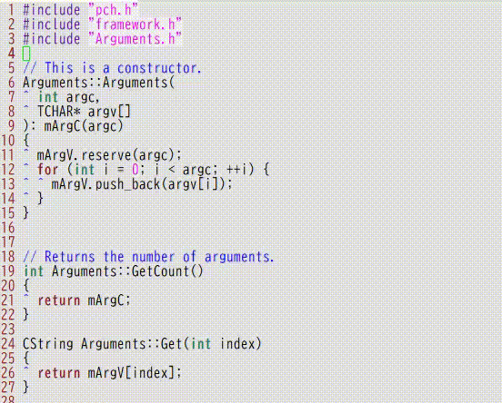

# vim-dsfcg

A Vim plugin for generating Doxygen-style function comments.



## OVERVIEW

This plugin provides the ability to automatically generate a Doxygen-recognizable 
function comment based on the content of text selected in visual mode.

In addition, changes to arguments can be reflected in the comments by selecting 
text and reexecuting the function, including the comments generated by this function.

The format of the generated comments can be customized through settings.

## SUPPORT LANGUAGES

  - C(including K&R style)
  - C++
  - Python
  - PHP
  - Ruby
  - Perl
  - JavaScript

## REQUIREMENTS

- With +python3 or +python3/dyn option
- Vim 9.0
  - It should probably work with older versions as long as the above options are available in your environment.

## FUNCTION

### DSMakeFunctionComment()

Executing this function will generate a function comment based on the content of the selected text.


## SETTINGS

The following variables are available.

- `g:dsfcg_format_header='/**'`
  - Format of function comment head

- `g:dsfcg_format_footer='**/'`
  - Format of function comment tail

- `g:dsfcg_comment_words= [ ['/*', '*/'], ['//', '\n'] ]`
  -  Keywords indicating the start and end of comments (written in a list)

- `g:dsfcg_element_order='DRA'`
  - Order of output within function comments  
For example, "DRA" generates comments in the order of function description, return value, and argument list.  
When a new comment is generated, the "D" line outputs the setting values of g:dsfcg_default_descriptionN(1~).  
  - To output multiple function description lines, write 'D' for the number of lines to be output,  
like "DDRA", and use g:dsfcg_default_description1="...". ,g:dsfcg_default_description2="..." Define as many variables as the number of output lines as shown in the following example.

- `g:dsfcg_is_alignment=0`
  - Specifies whether to output the function in a formatted output.
  - Only C/C++ available

- `g:dsfcg_user_keywords`
  -  user-defined keywords
  -  defaultmsg means the message when creating a new comment
```
g:dsfcg_user_keywords= { 
  \ 'defaultmsg' : "\tEnter description here.",
  \ 'date' : strftime("%Y-%m-%d"),
  \ }
```

- `g:dsfcg_default_description1 = "%defaultmsg"`
  - Description section when creating a new function comment

- `g:dsfcg_inout_types = [ "[in]", "[out]", "[in,out]" ]`
  - Keyword indicating the input/output type of the argument

- `g:dsfcg_permission_tags = [ "@public", "@protected", "@private" ]`
  - Specify tags for function access descriptors

- g:dsfcg_template_argument = "\t@param%inout %name %description"
  - Format of argument description line when creating a new function comment
    - `%inout` : I/O type
    - `%name` :  Argument name
    - `%description` : Argument desctiption

- `g:dsfcg_regexp_argument='.*?[\\@]param(.+?)\s+(.+?)\s+(.*)$'`
  - Regular expression patterns to identify argument description lines when parsing existing function comments.

- `g:dsfcg_escapetext_argument="%inout,%name,%description"`
  - Specifies which groups correspond to which elements as a result of regular expression matching with g:dsfcg_regexp_argument.
  - Specify by comma delimiter.

- `g:dsfcg_template_return = "\t@return %description"`
  - Output format of return value description line when creating a new function comment.
    - `%description` :  Description of return value

- `g:dsfcg_regexp_return='.*?[\\@]return\s*(.*)$'`
  - Regular expression patterns to identify return description lines when parsing existing function comments.

- `g:dsfcg_escapetext_return="%description"`
  - Specifies which group corresponds to which element as a result of regular expression matching with g:dsfcg_regexp_return.
  - Specify by comma delimiter.

- `g:dsfcg_enable_mapping = 1`
  - Enables/disables the default key mapping 'vmap m :<c-u>call DSMakeFunctionComment()<cr>'


All of the following variables can be set to file type-specific parameters 
by adding the suffix _<filetype> at the end.

## MAPPING

In visual-mode

- `m`
  - `:<c-r>DSMakeFunctionComment()<cr>`

If variable g:dsfcg_enable_mapping is 0, above mapping is disabled.

## LICENSE

[MIT](./LICENSE)

## CHANGELOG

### 0.1.7

2023-06-24

- Replace python with python3.
- Add README

### 0.1.6

2008-10-29

Bugfix for alignment output.

### 0.1.5

2008-09-24

Bugfix for keymapping.

### 0.1.4

2008-09-05

support PHP,Python,Perl,Ruby,JavaScript

### 0.1.3

2008-09-02

Add brief comment input. New support K&R style.

### 0.1.2

2008-08-31

Implement argument indent alignment.

### 0.1.1

2008-08-29

1st release.

